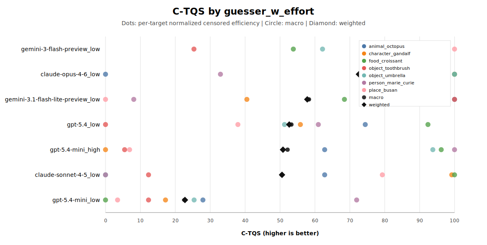

# Twenty Questions Benchmark

A polished multi-turn benchmark for measuring how efficiently LLMs can solve a hidden-target game through yes/no questions.

One model acts as the guesser. Another acts as the judge. Every run produces full prompts, event logs, transcripts, suite aggregates, and analysis-ready reports, so you can compare models with more visibility than a simple pass/fail leaderboard.

## Why This Repo

- Multi-turn evaluation instead of single-shot QA
- Cross-provider model comparisons with repeatable suite configs
- Full prompt and transcript logging for auditability
- Built-in suite analysis and plotting
- Small enough to iterate quickly, rich enough to expose search behavior


The overview plot is generated from local suite analysis output. See [Reproducibility](docs/reproducibility.md) for the exact commands and paths.

## C-TQS Metric (Censored Twenty Questions Score)

To evaluate twenty-questions skill without introducing a hard-cap artifact (for example, treating all failures as exactly 80 turns), this repo also supports a **censored time-to-solve metric**:

- Treat each run as `(time = turns_used, event = solved)`.
- `solved=False` is handled as **right-censored**, not as a true solved time.
- For each `target_id × guesser_w_effort`, compute a Kaplan-Meier survival curve and its restricted mean questions:

```text
RMQ(τ) = ∫[0,τ] S(t) dt
```

where lower RMQ means fewer expected questions within a shared horizon.

Then, per target, convert RMQ into a 0–100 relative score:

```text
C-TQS(model,target) =
100 * (RMQ_worst(target) - RMQ_model(target))
      / (RMQ_worst(target) - RMQ_best(target))
```

For model-level aggregation, we report both:

- **C-TQS (macro):** plain mean across targets.
- **C-TQS (weighted):** target-weighted mean, with `weight(target) = sqrt(n_eff_target)` and `n_eff_target` defined as the minimum observed run count across compared models for that target.

The weighted score is the default ranking metric in the generated figure, while macro is shown as a companion reference.

Generate the plot from `results/results.csv`:

```bash
python3 -m analysis.plot_c_tqs \
  --input results/results.csv \
  --output img/c_tqs_model_ranking.png
```

If Matplotlib is unavailable in the environment, the script automatically writes an SVG fallback at `img/c_tqs_model_ranking.svg`.



## What You Can Do

- Run a single target game and inspect the full transcript
- Run repeated evaluation suites across multiple models and targets
- Aggregate many suite runs into a single benchmark report
- Regenerate a leaderboard-style overview plot from fresh results

## How It Works

```text
    Guesser                      Judge
       |                           |
       |--- "Is it a place?" ----->|
       |<-- {"label":"Yes"} -------|
       |                           |
       |--- "Is it in Europe?" --->|
       |<-- {"label":"Yes"} -------|
       |                           |
       |--- "Is it Paris?" ------->|
       |<-- {"label":"Yes"} -------|  => SOLVED in 3 turns
```

- There is no separate "final guess" phase.
- The guesser wins by asking a direct identity-check question that the judge confirms.
- Every turn is logged with prompts, raw outputs, judgments, latency, and transcript artifacts.

## Targets

16 targets across 6 domains:

| Domain | Targets |
|--------|---------|
| animals | elephant, eagle, octopus |
| characters | Sherlock Holmes |
| foods | pizza |
| objects | toothbrush, refrigerator, umbrella, bicycle, laptop, violin |
| people | Marie Curie, Abraham Lincoln |
| places | Paris, Busan, volcano |

Target records live in [`data/all_target.csv`](data/all_target.csv) and are validated against [`schemas/target.schema.json`](schemas/target.schema.json).

## Quick Start

### Prerequisites

- Python 3.10+
- API keys for the providers you want to test

Create a `.env` file:

```bash
gemini_key=...
OPENAI_API_KEY=...
CLAUDE_API_KEY=...
# or ANTHROPIC_API_KEY=...
```

### Run a Single Game

```bash
python3 -m twentyq.run_single_game \
  --target-id place_paris \
  --budget 40 \
  --guesser-model gpt-5.4 \
  --judge-model gemini-3-flash-preview
```

### Run a Repeated Suite

```bash
python3 -m twentyq.run_single_target_suite \
  --config configs/single_target_suites/evaluation_v3.json
```

This writes a timestamped suite directory under `reports/single-target-suite/`.

### Run Cross-Suite Analysis

```bash
python3 -m analysis.analyze_single_target_suite --completed-only
```

This writes:

- `reports/single-target-suite/benchmark-analysis/aggregate.json`
- `reports/single-target-suite/benchmark-analysis/report.md`

### Regenerate the Overview Plot

```bash
python3 -m analysis.plot_model_overview
```

By default this reads `reports/single-target-suite/benchmark-analysis/aggregate.json` and writes `img/model_overview.png`.

### Reasoning Configuration

```bash
python3 -m twentyq.run_single_game \
  --target-id object_toothbrush \
  --budget 20 \
  --guesser-model gemini-2.5-flash \
  --guesser-thinking-budget 512 \
  --judge-model gemini-3-flash-preview \
  --judge-thinking-level low
```

## Output & Logging

Each single-game run produces:

| Artifact | Description |
|----------|-------------|
| `run_config.json` | Run configuration |
| `summary.json` | Outcome summary |
| `events.jsonl` | Turn-by-turn event log |
| `episodes/<target>.json` | Full transcript and metadata |
| `episodes/<target>.md` | Human-readable transcript |

Suite runs additionally produce:

| Artifact | Description |
|----------|-------------|
| `manifest.json` | Planned targets, variants, repetitions, and resolved reasoning settings |
| `status.json` | Progress and active-run status |
| `results.json` | Per-run records |
| `aggregate.json` | Per-target and per-variant aggregates |
| `report.md` | Markdown summary for the suite |

Cross-suite analysis writes `aggregate.json` and `report.md` under `reports/single-target-suite/benchmark-analysis/`.

## Scope

This repository is best used as a controlled interactive benchmark:

- the prompt scaffold is fixed and intentional
- results depend on the chosen judge model and judge prompt
- the target set is explicit and relatively small
- provider-native multi-turn API behavior is part of what gets measured

That makes the project useful for side-by-side comparisons, regression tracking, and protocol experiments. Results should be read as performance inside this benchmark design, not as a universal ranking of model intelligence.

## Repository Layout

```text
twentyq/
  episode_runner.py               # shared gameplay engine
  run_single_game.py              # single-target CLI
  run_benchmark.py                # one-pass benchmark runner
  run_single_target_suite.py      # repeated suite runner

analysis/
  analyze_single_target_suite.py  # cross-suite aggregation
  plot_model_overview.py          # overview scatter plot

configs/single_target_suites/     # suite configuration files
data/                             # target records
docs/                             # benchmark scope and reproducibility notes
img/                              # generated and checked-in images
project_review/                   # external critique notes and adjudication
prompts/                          # guesser and judge prompt templates
reports/                          # generated run outputs (gitignored)
schemas/                          # target schema
tests/                            # unit tests
```

## Documentation

- [Benchmark Design](docs/benchmark-design.md)
- [Prompt Scaffold](docs/prompt-scaffold.md)
- [Reproducibility](docs/reproducibility.md)

## License

MIT
