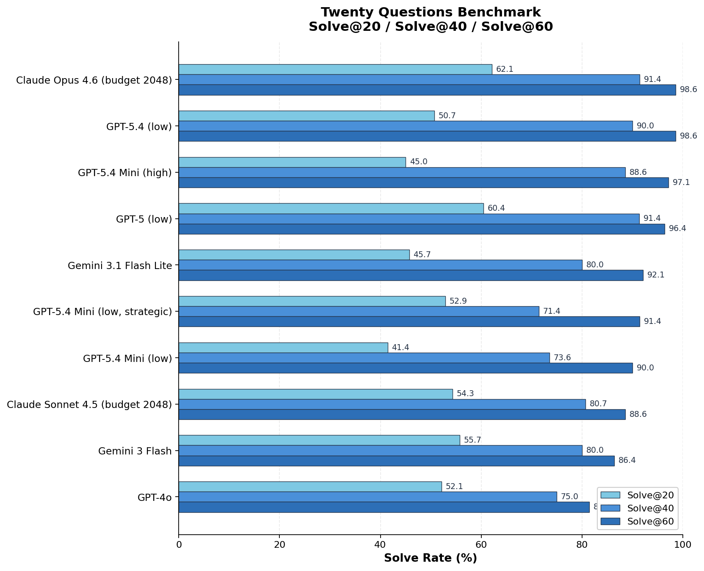

# Twenty Questions Benchmark

A polished multi-turn benchmark for measuring how efficiently LLMs can solve a hidden-target game through yes/no questions.

This benchmark is meant to capture something many static QA leaderboards miss: interactive search under uncertainty. To succeed, a model has to ask discriminative yes/no questions, update its internal hypothesis after each answer, and decide when to stop exploring and commit to a direct identity check. In practice, that makes it a compact test of question selection, hypothesis tracking, and budgeted decision-making rather than pure one-shot recall.

At a deeper level, the benchmark is trying to measure a model's ability to reduce uncertainty through dialogue: ask high-information questions, maintain and revise a working hypothesis over multiple turns, and convert that narrowed search space into a precise identification at the right moment. That makes the repository a useful bridge between simple single-turn evals and looser agent benchmarks.

One model acts as the guesser. Another acts as the judge. The protocol is intentionally explicit: target records, prompt templates, judge policy, reasoning settings, and logs are all inspectable, so runs can be compared under a clearly specified setup and audited from full transcripts rather than a black-box win rate alone. Every run produces prompts, event logs, transcripts, suite aggregates, and analysis-ready reports.

## Why This Benchmark Matters

- It evaluates interactive uncertainty reduction instead of single-shot recall.
- It keeps the protocol fixed enough that side-by-side model comparisons are interpretable.
- It logs full trajectories, so you can inspect search behavior and failure modes rather than only win/loss outcomes.
- It is small enough to rerun frequently, but rich enough to expose meaningful differences in questioning strategy.

## How It Works

```text
    Guesser                      Judge
       |                           |
       |--- "Is it a place?" ----->|
       |<-- {"label":"Yes"} -------|
       |                           |
       |--- "Is it in Europe?" --->|
       |<-- {"label":"Yes"} -------|
       |                           |
       |--- "Is it Paris?" ------->|
       |<-- {"label":"Yes"} -------|  => SOLVED in 3 turns
```

- There is no separate "final guess" phase.
- The guesser wins by asking a direct identity-check question that the judge confirms.
- Every turn is logged with prompts, raw outputs, judgments, latency, and transcript artifacts.

## Benchmark Results

The primary checked-in snapshot now reports **Solve@20**, **Solve@40**, and **Solve@60** from `results/results.csv`. This keeps the metric family simple and makes ceiling sensitivity explicit instead of hiding it inside a single aggregate score.

| Rank | Model | Solve@20 | Solve@40 | Solve@60 | Runs |
|-----:|-------|---------:|---------:|---------:|-----:|
| 1 | Claude Opus 4.6 (budget 2048) | 62.14% | 91.43% | 98.57% | 140 |
| 2 | GPT-5 (low) | 60.43% | 91.37% | 96.40% | 139 |
| 3 | GPT-5.4 (low) | 50.71% | 90.00% | 98.57% | 140 |
| 4 | GPT-5.4 Mini (high) | 45.00% | 88.57% | 97.14% | 140 |
| 5 | Gemini 3 Flash | 55.71% | 80.00% | 86.43% | 140 |
| 6 | Claude Sonnet 4.5 (budget 2048) | 54.29% | 80.71% | 88.57% | 140 |
| 7 | GPT-4o | 52.14% | 75.00% | 81.43% | 140 |
| 8 | GPT-5.4 Mini (low, strategic) | 52.86% | 71.43% | 91.43% | 70 |
| 9 | Gemini 3.1 Flash Lite | 45.71% | 80.00% | 92.14% | 140 |
| 10 | GPT-5.4 Mini (low) | 41.43% | 73.57% | 90.00% | 140 |

**Snapshot takeaways:**

- **GPT-5.4 Mini low vs high:** `high` improves Solve@20 from 41.43% to 45.00%, Solve@40 from 73.57% to 88.57%, and Solve@60 from 90.00% to 97.14%. It also improves overall solve rate from 93.57% to 98.57% and lowers average turns per solved game from 28.24 to 24.09.
- **GPT-5.4 Mini low vs low+strategic prompt:** `gpt-5.4-mini_low_strategic` improves Solve@20 from 41.43% to 52.86%, Solve@60 from 90.00% to 91.43%, and lowers average turns per solved game from 28.24 to 26.14. Solve@40 is slightly worse at 71.43% versus 73.57%, so the current strategic prompt looks more like an early-game improvement than a uniform gain. This strategic sample currently covers 70 runs, versus 140 for the default low setting.

The checked-in cutoff plot below is generated from `results/results.csv`.

```bash
python3 -m analysis.plot_solve_at_cutoffs \
  --input results/results.csv \
  --output img/solve_at_cutoffs.png \
  --cutoffs 20,40,60
```



See [Reproducibility](docs/reproducibility.md) for the broader workflow and reporting expectations.

## Typical Workflows

- Run a single target game and inspect the full transcript
- Run repeated evaluation suites across multiple models and targets
- Aggregate many suite runs into a single benchmark report
- Regenerate a leaderboard-style overview plot from fresh results

## Targets

21 targets across 6 domains:

| Domain | Targets |
|--------|---------|
| animals | elephant, eagle, octopus, platypus |
| characters | Sherlock Holmes, Gandalf |
| foods | pizza, croissant |
| objects | toothbrush, refrigerator, umbrella, bicycle, laptop, violin, stapler |
| people | Marie Curie, Abraham Lincoln |
| places | Paris, Busan, volcano, Sahara Desert |

Target records live in [`data/all_target.csv`](data/all_target.csv) and are validated against [`schemas/target.schema.json`](schemas/target.schema.json).

## Quick Start

### Prerequisites

- Python 3.10+
- API keys for the providers you want to test

Create a `.env` file:

```bash
gemini_key=...
OPENAI_API_KEY=...      # or openai_key
CLAUDE_API_KEY=...      # or ANTHROPIC_API_KEY / anthropic_key
```

### Run a Single Game

```bash
python3 -m twentyq.run_single_game \
  --target-id place_paris \
  --budget 40 \
  --guesser-prompt-set strategic \
  --guesser-model gpt-5.4 \
  --judge-model gemini-3-flash-preview
```

By default this writes a new run directory under `runs/`.

### Run a Repeated Suite

```bash
python3 -m twentyq.run_single_target_suite \
  --config configs/single_target_suites/evaluation_v3.json
```

This writes a timestamped suite directory under `reports/single-target-suite/`.

### Run a Prompt Ablation

The guesser scaffold is now replaceable. `default` preserves the original minimal prompt. `strategic` adds a more explicit high-information / early-guess policy.

For a ready-made strategic-prompt suite, use:

```bash
python3 -m twentyq.run_single_target_suite \
  --config configs/single_target_suites/prompt_ablation_gpt54.json
```

You can also define your own pair of prompt files with:

- `guesser_prompt_set`
- `guesser_initial_prompt_path`
- `guesser_turn_prompt_path`

### Run Cross-Suite Analysis

```bash
python3 -m analysis.analyze_single_target_suite --completed-only
```

This writes:

- `reports/single-target-suite/benchmark-analysis/aggregate.json`
- `reports/single-target-suite/benchmark-analysis/report.md`

### Regenerate the Overview Plot

```bash
python3 -m analysis.plot_model_overview
```

By default this reads `results/results.csv` and writes `img/model_overview.png`.

### Reasoning Configuration

```bash
python3 -m twentyq.run_single_game \
  --target-id object_toothbrush \
  --budget 20 \
  --guesser-model gemini-2.5-flash \
  --guesser-thinking-budget 512 \
  --judge-model gemini-3-flash-preview \
  --judge-thinking-level low
```

## Output & Logging

A single game writes one run directory under `runs/` by default. A repeated suite writes a timestamped directory under `reports/single-target-suite/`, with per-run logs under that suite's `runs/` subdirectory.

Each single-game run directory contains:

| Artifact | Description |
|----------|-------------|
| `run_config.json` | Run configuration |
| `summary.json` | Outcome summary |
| `events.jsonl` | Turn-by-turn event log |
| `episodes/<target>.json` | Full transcript and metadata |
| `episodes/<target>.md` | Human-readable transcript |

Suite runs additionally produce:

| Artifact | Description |
|----------|-------------|
| `manifest.json` | Planned targets, variants, repetitions, and resolved reasoning settings |
| `status.json` | Progress and active-run status |
| `results.json` | Per-run records |
| `aggregate.json` | Per-target and per-variant aggregates |
| `report.md` | Markdown summary for the suite |

Cross-suite analysis writes `aggregate.json` and `report.md` under `reports/single-target-suite/benchmark-analysis/`.

## Interpretation

This repository is best used as a controlled interactive benchmark:

- the prompt scaffold is fixed and intentional
- the checked-in benchmark results use the default guesser prompt set
- results depend on the chosen judge model and judge prompt
- results also depend on the chosen guesser prompt set
- the target set is explicit and relatively small
- provider-native multi-turn API behavior is part of what gets measured

That makes the project useful for side-by-side comparisons, regression tracking, and protocol experiments. Results should be read as performance inside this benchmark design, not as a universal ranking of model intelligence.

## Repository Layout

```text
twentyq/
  episode_runner.py               # shared gameplay engine
  run_single_game.py              # single-target CLI
  run_benchmark.py                # one-pass benchmark runner
  run_single_target_suite.py      # repeated suite runner

analysis/
  analyze_single_target_suite.py  # cross-suite aggregation
  plot_model_overview.py          # solve-rate vs turns scatter plot
  plot_solve_at_cutoffs.py        # grouped Solve@20 / Solve@40 / Solve@60 bars
  plot_weighted_efficiency.py     # DWEI ranking plot

configs/single_target_suites/     # suite configuration files
data/                             # target records
docs/                             # benchmark scope and reproducibility notes
img/                              # generated and checked-in images
prompts/                          # guesser and judge prompt templates
reports/                          # generated run outputs (gitignored)
results/                          # checked-in run-level CSV snapshots
schemas/                          # target schema
tests/                            # unit tests
```

## Documentation

- [Benchmark Design](docs/benchmark-design.md)
- [Prompt Scaffold](docs/prompt-scaffold.md)
- [Reproducibility](docs/reproducibility.md)

## License

MIT
