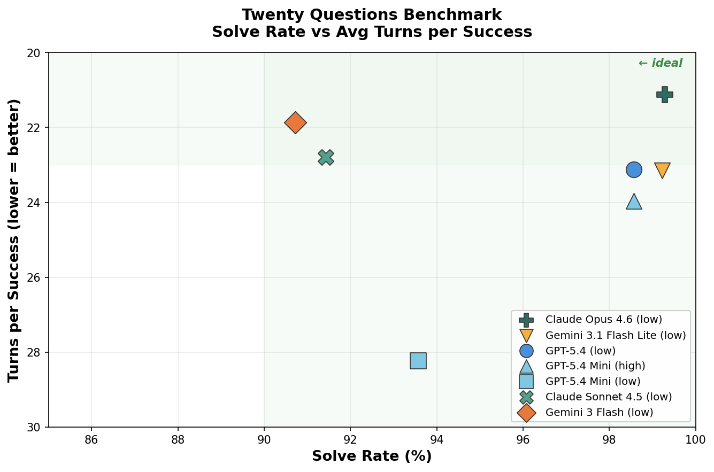
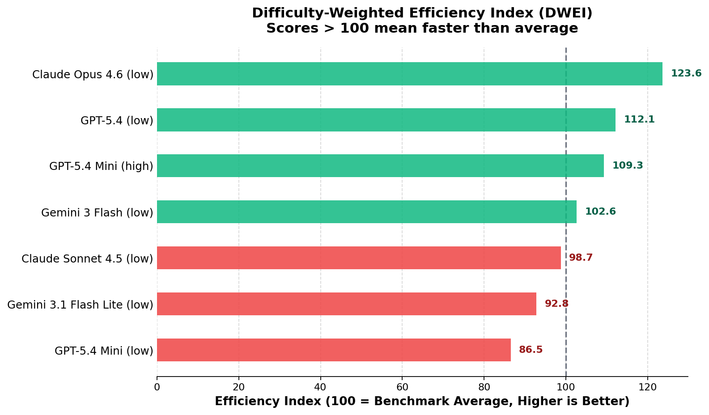

# Twenty Questions Benchmark

A polished multi-turn benchmark for measuring how efficiently LLMs can solve a hidden-target game through yes/no questions.

One model acts as the guesser. Another acts as the judge. Every run produces full prompts, event logs, transcripts, suite aggregates, and analysis-ready reports, so you can compare models with more visibility than a simple pass/fail leaderboard.

## Why This Repo

- Multi-turn evaluation instead of single-shot QA
- Cross-provider model comparisons with repeatable suite configs
- Full prompt and transcript logging for auditability
- Built-in suite analysis and plotting
- Small enough to iterate quickly, rich enough to expose search behavior



The overview plot is generated from `results/results.csv`. See [Reproducibility](docs/reproducibility.md) for the exact commands and paths.

## How It Works

```text
    Guesser                      Judge
       |                           |
       |--- "Is it a place?" ----->|
       |<-- {"label":"Yes"} -------|
       |                           |
       |--- "Is it in Europe?" --->|
       |<-- {"label":"Yes"} -------|
       |                           |
       |--- "Is it Paris?" ------->|
       |<-- {"label":"Yes"} -------|  => SOLVED in 3 turns
```

- There is no separate "final guess" phase.
- The guesser wins by asking a direct identity-check question that the judge confirms.
- Every turn is logged with prompts, raw outputs, judgments, latency, and transcript artifacts.

## Benchmark Results

The table below summarizes per-model performance across the 979 runs currently present in `results/results.csv`. Each model variant is identified by the base model and its reasoning effort setting (e.g., `low` or `high`).

| Rank | Model | Solve Rate | Avg Turns / Success | Runs |
|-----:|-------|----------:|--------------------:|-----:|
| 1 | Claude Opus 4.6 (low) | 99.29% | 21.13 | 140 |
| 2 | GPT-5.4 (low) | 98.57% | 23.12 | 140 |
| 3 | GPT-5.4 Mini (high) | 98.56% | 23.97 | 139 |
| 4 | Gemini 3.1 Flash Lite (low) | 93.57% | 25.05 | 140 |
| 5 | GPT-5.4 Mini (low) | 93.57% | 28.24 | 140 |
| 6 | Claude Sonnet 4.5 (low) | 91.43% | 22.79 | 140 |
| 7 | Gemini 3 Flash (low) | 90.71% | 21.87 | 140 |

**Key takeaways:**

- **Claude Opus 4.6** leads in both solve rate (99.3%) and efficiency (21.1 turns per success), placing it firmly in the "ideal" quadrant of the scatter plot.
- **Reasoning effort matters.** GPT-5.4 Mini with `high` effort solves 5 percentage points more often than its `low` counterpart, though at a slight cost in average turns.
- **High solve rate does not guarantee fast solves.** Gemini 3 Flash (low) and Claude Sonnet 4.5 (low) both solve fewer games overall but do so in fewer turns when they succeed. The scatter plot captures this trade-off directly.
- All models were judged by the same judge configuration, so differences reflect guesser behavior, not judging variance.

## DWEI Metric (Difficulty-Weighted Efficiency Index)

### Why a specialized metric?

Solve rate and average turns are useful but incomplete. 
- A model that solves 95% of games in 40 turns each is arguably worse than one that solves 90% in 15 turns. 
- When a model *fails* to solve a target, it hits the maximum budget (e.g., 40 or 80 turns). Excluding these failures causes extreme **survivor bias**, making models that only solve easy problems look artificially fast.
- Easy problems and hard problems take vastly different numbers of turns. A simple turn difference on an easy problem should not carry the same absolute weight as a difference on a hard problem.

DWEI addresses these issues by leveraging **survival analysis** and **difficulty-weighting** to create a mathematically robust and intuitive "efficiency index".

### How it works

1. **Calculate Target RMQ ($R_{m,i}$):** Each game yields `(turns_used, solved)`. For each `target × model` combination, we fit a Kaplan-Meier survival curve up to the target's maximum recorded turn horizon. The integral (area under this curve) is the Restricted Mean Questions (RMQ), representing the expected number of turns to solve. This cleanly penalizes failures without invoking survivor bias.
2. **Determine Problem Difficulty ($D_i$):** A target's difficulty is the average RMQ across all evaluated models for that target. Higher $D_i$ means the problem was universally harder.
3. **Calculate Efficiency Ratio ($1 / RMQ$):** We calculate a speedup ratio for each model on each target:
   `Efficiency = Difficulty / Target RMQ`
   If a problem's difficulty is 40 turns on average, and a model solves it in 20 turns, its efficiency ratio is 2.0. If it solves an easy 10-turn problem in 5 turns, the ratio is identically 2.0. This ensures that hard problems naturally reward fast, persistent solvers.
4. **Final Index (DWEI):** We compute the unweighted mean of this efficiency ratio across all targets, then multiply by 100.
   `DWEI = 100 × Mean( D_i / R_{m,i} )`

### Interpreting the score

A score of **100** represents the exact benchmark average efficiency. 
A score of **120** means the model is, on average, solving these targets **20% faster / more efficiently** than the baseline field of evaluated models. 

### Current DWEI rankings

| Rank | Model | DWEI Score |
|-----:|-------|-----------:|
| 1 | Claude Opus 4.6 (low) | 123.6 |
| 2 | GPT-5.4 (low) | 112.1 |
| 3 | GPT-5.4 Mini (high) | 109.3 |
| 4 | Gemini 3 Flash (low) | 102.6 |
| 5 | Claude Sonnet 4.5 (low) | 98.7 |
| 6 | Gemini 3.1 Flash Lite (low) | 92.8 |
| 7 | GPT-5.4 Mini (low) | 86.5 |

Notably, while some smaller models like **Gemini 3 Flash** or **Claude Sonnet 4.5** have fast median turn times when successful, their ~9% failure rates cause their survival curves to decay slower, keeping their final efficiency index properly anchored near 100. Models like **Claude Opus** maintain near 100% win rates *along* with high speed, resulting in massive efficiency gains.

### Generate the plot

```bash
python3 -m analysis.plot_weighted_efficiency \
  --input results/results.csv \
  --output img/weighted_efficiency_ranking.png
```



## What You Can Do

- Run a single target game and inspect the full transcript
- Run repeated evaluation suites across multiple models and targets
- Aggregate many suite runs into a single benchmark report
- Regenerate a leaderboard-style overview plot from fresh results

## Targets

16 targets across 6 domains:

| Domain | Targets |
|--------|---------|
| animals | elephant, eagle, octopus |
| characters | Sherlock Holmes |
| foods | pizza |
| objects | toothbrush, refrigerator, umbrella, bicycle, laptop, violin |
| people | Marie Curie, Abraham Lincoln |
| places | Paris, Busan, volcano |

Target records live in [`data/all_target.csv`](data/all_target.csv) and are validated against [`schemas/target.schema.json`](schemas/target.schema.json).

## Quick Start

### Prerequisites

- Python 3.10+
- API keys for the providers you want to test

Create a `.env` file:

```bash
gemini_key=...
OPENAI_API_KEY=...
CLAUDE_API_KEY=...
# or ANTHROPIC_API_KEY=...
```

### Run a Single Game

```bash
python3 -m twentyq.run_single_game \
  --target-id place_paris \
  --budget 40 \
  --guesser-model gpt-5.4 \
  --judge-model gemini-3-flash-preview
```

### Run a Repeated Suite

```bash
python3 -m twentyq.run_single_target_suite \
  --config configs/single_target_suites/evaluation_v3.json
```

This writes a timestamped suite directory under `reports/single-target-suite/`.

### Run Cross-Suite Analysis

```bash
python3 -m analysis.analyze_single_target_suite --completed-only
```

This writes:

- `reports/single-target-suite/benchmark-analysis/aggregate.json`
- `reports/single-target-suite/benchmark-analysis/report.md`

### Regenerate the Overview Plot

```bash
python3 -m analysis.plot_model_overview
```

By default this reads `results/results.csv` and writes `img/model_overview.png`.

### Reasoning Configuration

```bash
python3 -m twentyq.run_single_game \
  --target-id object_toothbrush \
  --budget 20 \
  --guesser-model gemini-2.5-flash \
  --guesser-thinking-budget 512 \
  --judge-model gemini-3-flash-preview \
  --judge-thinking-level low
```

## Output & Logging

Each single-game run produces:

| Artifact | Description |
|----------|-------------|
| `run_config.json` | Run configuration |
| `summary.json` | Outcome summary |
| `events.jsonl` | Turn-by-turn event log |
| `episodes/<target>.json` | Full transcript and metadata |
| `episodes/<target>.md` | Human-readable transcript |

Suite runs additionally produce:

| Artifact | Description |
|----------|-------------|
| `manifest.json` | Planned targets, variants, repetitions, and resolved reasoning settings |
| `status.json` | Progress and active-run status |
| `results.json` | Per-run records |
| `aggregate.json` | Per-target and per-variant aggregates |
| `report.md` | Markdown summary for the suite |

Cross-suite analysis writes `aggregate.json` and `report.md` under `reports/single-target-suite/benchmark-analysis/`.

## Scope

This repository is best used as a controlled interactive benchmark:

- the prompt scaffold is fixed and intentional
- results depend on the chosen judge model and judge prompt
- the target set is explicit and relatively small
- provider-native multi-turn API behavior is part of what gets measured

That makes the project useful for side-by-side comparisons, regression tracking, and protocol experiments. Results should be read as performance inside this benchmark design, not as a universal ranking of model intelligence.

## Repository Layout

```text
twentyq/
  episode_runner.py               # shared gameplay engine
  run_single_game.py              # single-target CLI
  run_benchmark.py                # one-pass benchmark runner
  run_single_target_suite.py      # repeated suite runner

analysis/
  analyze_single_target_suite.py  # cross-suite aggregation
  plot_model_overview.py          # overview scatter plot

configs/single_target_suites/     # suite configuration files
data/                             # target records
docs/                             # benchmark scope and reproducibility notes
img/                              # generated and checked-in images
project_review/                   # external critique notes and adjudication
prompts/                          # guesser and judge prompt templates
reports/                          # generated run outputs (gitignored)
schemas/                          # target schema
tests/                            # unit tests
```

## Documentation

- [Benchmark Design](docs/benchmark-design.md)
- [Prompt Scaffold](docs/prompt-scaffold.md)
- [Reproducibility](docs/reproducibility.md)

## License

MIT
