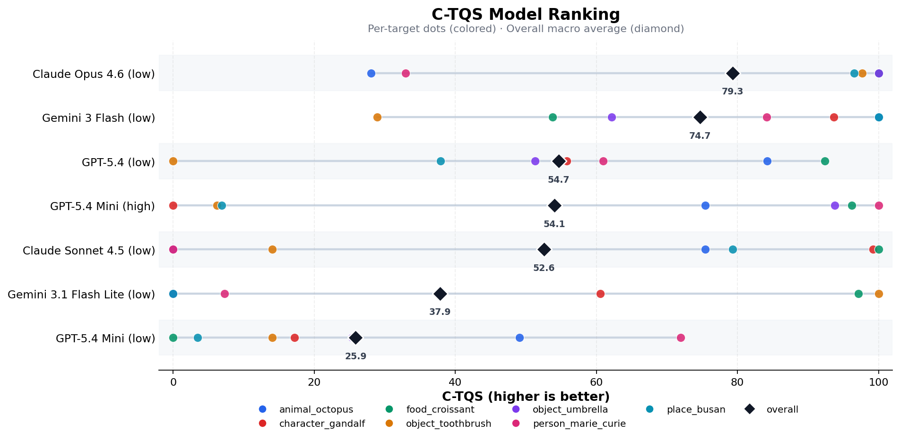

# Twenty Questions Benchmark

A polished multi-turn benchmark for measuring how efficiently LLMs can solve a hidden-target game through yes/no questions.

One model acts as the guesser. Another acts as the judge. Every run produces full prompts, event logs, transcripts, suite aggregates, and analysis-ready reports, so you can compare models with more visibility than a simple pass/fail leaderboard.

## Why This Repo

- Multi-turn evaluation instead of single-shot QA
- Cross-provider model comparisons with repeatable suite configs
- Full prompt and transcript logging for auditability
- Built-in suite analysis and plotting
- Small enough to iterate quickly, rich enough to expose search behavior


The overview plot is generated from `results/results.csv`. See [Reproducibility](docs/reproducibility.md) for the exact commands and paths.

## How It Works

```text
    Guesser                      Judge
       |                           |
       |--- "Is it a place?" ----->|
       |<-- {"label":"Yes"} -------|
       |                           |
       |--- "Is it in Europe?" --->|
       |<-- {"label":"Yes"} -------|
       |                           |
       |--- "Is it Paris?" ------->|
       |<-- {"label":"Yes"} -------|  => SOLVED in 3 turns
```

- There is no separate "final guess" phase.
- The guesser wins by asking a direct identity-check question that the judge confirms.
- Every turn is logged with prompts, raw outputs, judgments, latency, and transcript artifacts.

## Benchmark Results

The table below summarizes per-model performance across the 979 runs currently present in `results/results.csv`. Each model variant is identified by the base model and its reasoning effort setting (e.g., `low` or `high`).

| Rank | Model | Solve Rate | Avg Turns / Success | Runs |
|-----:|-------|----------:|--------------------:|-----:|
| 1 | Claude Opus 4.6 (low) | 99.29% | 21.13 | 140 |
| 2 | GPT-5.4 (low) | 98.57% | 23.12 | 140 |
| 3 | GPT-5.4 Mini (high) | 98.56% | 23.97 | 139 |
| 4 | Gemini 3.1 Flash Lite (low) | 93.57% | 25.05 | 140 |
| 5 | GPT-5.4 Mini (low) | 93.57% | 28.24 | 140 |
| 6 | Claude Sonnet 4.5 (low) | 91.43% | 22.79 | 140 |
| 7 | Gemini 3 Flash (low) | 90.71% | 21.87 | 140 |

**Key takeaways:**

- **Claude Opus 4.6** leads in both solve rate (99.3%) and efficiency (21.1 turns per success), placing it firmly in the "ideal" quadrant of the scatter plot.
- **Reasoning effort matters.** GPT-5.4 Mini with `high` effort solves 5 percentage points more often than its `low` counterpart, though at a slight cost in average turns.
- **High solve rate does not guarantee fast solves.** Gemini 3 Flash (low) and Claude Sonnet 4.5 (low) both solve fewer games overall but do so in fewer turns when they succeed. The scatter plot captures this trade-off directly.
- All models were judged by the same judge configuration, so differences reflect guesser behavior, not judging variance.

## C-TQS Metric (Censored Twenty Questions Score)

### Why a specialized metric?

Solve rate and average turns are useful but incomplete. A model that solves 95% of games in 40 turns each is arguably worse than one that solves 90% in 15 turns. And when a model *fails* to solve a target, capping it at the budget (e.g., 80 turns) pollutes the average with an arbitrary penalty. C-TQS addresses both issues by borrowing from survival analysis.

### How it works

C-TQS treats each game as a time-to-event observation:

1. **Record observations.** Each run yields a pair `(turns_used, solved)`. Solved runs are *events*; unsolved runs are *right-censored* — we know the model used at least that many turns, but not how many it would have needed.

2. **Estimate a survival curve.** For each `target × model` combination, fit a Kaplan-Meier curve. The survival function `S(t)` represents the probability that the model has *not yet solved* the target by turn `t`.

3. **Compute the Restricted Mean Questions (RMQ).** Integrate the survival curve up to a shared horizon `τ`:

   ```text
   RMQ(τ) = ∫[0,τ] S(t) dt
   ```

   Lower RMQ means the model solves faster within the comparison window. The horizon `τ` is set per target as the minimum of each model's maximum observed turn count, ensuring every model is compared over a fair, fully-observed range.

4. **Normalize to a 0–100 score.** Per target, scale each model's RMQ relative to the best and worst model on that target:

   ```text
   C-TQS(model, target) =
     100 × (RMQ_worst − RMQ_model) / (RMQ_worst − RMQ_best)
   ```

   A score of 100 means the model is the fastest solver on that target; 0 means the slowest.

5. **Macro-average.** The final C-TQS for a model is the unweighted mean across all targets.

### Interpreting the chart

The C-TQS ranking chart shows each model as a row. Colored dots represent per-target scores, and the black diamond marks the overall macro average. The horizontal spread of dots reveals *consistency*: a model with tightly clustered dots performs uniformly across targets, while wide spread indicates uneven strengths.

| C-TQS Range | Interpretation |
|-------------|----------------|
| 80–100 | Consistently among the fastest solvers across targets |
| 50–80 | Competitive but not dominant; may struggle on specific targets |
| 20–50 | Below average efficiency relative to the field |
| 0–20 | Significantly slower than peers on most targets |

### Current C-TQS rankings

| Rank | Model | C-TQS |
|-----:|-------|------:|
| 1 | Claude Opus 4.6 (low) | 79.31 |
| 2 | Gemini 3 Flash (low) | 74.68 |
| 3 | GPT-5.4 (low) | 54.66 |
| 4 | GPT-5.4 Mini (high) | 54.08 |
| 5 | Claude Sonnet 4.5 (low) | 52.57 |
| 6 | Gemini 3.1 Flash Lite (low) | 37.86 |
| 7 | GPT-5.4 Mini (low) | 25.88 |

Notably, **Gemini 3 Flash** ranks 2nd in C-TQS despite placing 7th in raw solve rate. This reflects that when it does solve, it solves *fast* — exactly the kind of nuance C-TQS is designed to capture.

### Caveats

- C-TQS is a *relative* metric. Adding or removing a model changes the best/worst anchors and can shift all scores.
- The per-target horizon `τ` depends on the models being compared. A model with very short runs can compress the horizon and reduce discrimination.
- Targets with few runs per model produce noisier survival estimates.

### Generate the plot

```bash
python3 -m analysis.plot_c_tqs \
  --input results/results.csv \
  --output img/c_tqs_model_ranking.png
```



## What You Can Do

- Run a single target game and inspect the full transcript
- Run repeated evaluation suites across multiple models and targets
- Aggregate many suite runs into a single benchmark report
- Regenerate a leaderboard-style overview plot from fresh results

## Targets

16 targets across 6 domains:

| Domain | Targets |
|--------|---------|
| animals | elephant, eagle, octopus |
| characters | Sherlock Holmes |
| foods | pizza |
| objects | toothbrush, refrigerator, umbrella, bicycle, laptop, violin |
| people | Marie Curie, Abraham Lincoln |
| places | Paris, Busan, volcano |

Target records live in [`data/all_target.csv`](data/all_target.csv) and are validated against [`schemas/target.schema.json`](schemas/target.schema.json).

## Quick Start

### Prerequisites

- Python 3.10+
- API keys for the providers you want to test

Create a `.env` file:

```bash
gemini_key=...
OPENAI_API_KEY=...
CLAUDE_API_KEY=...
# or ANTHROPIC_API_KEY=...
```

### Run a Single Game

```bash
python3 -m twentyq.run_single_game \
  --target-id place_paris \
  --budget 40 \
  --guesser-model gpt-5.4 \
  --judge-model gemini-3-flash-preview
```

### Run a Repeated Suite

```bash
python3 -m twentyq.run_single_target_suite \
  --config configs/single_target_suites/evaluation_v3.json
```

This writes a timestamped suite directory under `reports/single-target-suite/`.

### Run Cross-Suite Analysis

```bash
python3 -m analysis.analyze_single_target_suite --completed-only
```

This writes:

- `reports/single-target-suite/benchmark-analysis/aggregate.json`
- `reports/single-target-suite/benchmark-analysis/report.md`

### Regenerate the Overview Plot

```bash
python3 -m analysis.plot_model_overview
```

By default this reads `results/results.csv` and writes `img/model_overview.png`.

### Reasoning Configuration

```bash
python3 -m twentyq.run_single_game \
  --target-id object_toothbrush \
  --budget 20 \
  --guesser-model gemini-2.5-flash \
  --guesser-thinking-budget 512 \
  --judge-model gemini-3-flash-preview \
  --judge-thinking-level low
```

## Output & Logging

Each single-game run produces:

| Artifact | Description |
|----------|-------------|
| `run_config.json` | Run configuration |
| `summary.json` | Outcome summary |
| `events.jsonl` | Turn-by-turn event log |
| `episodes/<target>.json` | Full transcript and metadata |
| `episodes/<target>.md` | Human-readable transcript |

Suite runs additionally produce:

| Artifact | Description |
|----------|-------------|
| `manifest.json` | Planned targets, variants, repetitions, and resolved reasoning settings |
| `status.json` | Progress and active-run status |
| `results.json` | Per-run records |
| `aggregate.json` | Per-target and per-variant aggregates |
| `report.md` | Markdown summary for the suite |

Cross-suite analysis writes `aggregate.json` and `report.md` under `reports/single-target-suite/benchmark-analysis/`.

## Scope

This repository is best used as a controlled interactive benchmark:

- the prompt scaffold is fixed and intentional
- results depend on the chosen judge model and judge prompt
- the target set is explicit and relatively small
- provider-native multi-turn API behavior is part of what gets measured

That makes the project useful for side-by-side comparisons, regression tracking, and protocol experiments. Results should be read as performance inside this benchmark design, not as a universal ranking of model intelligence.

## Repository Layout

```text
twentyq/
  episode_runner.py               # shared gameplay engine
  run_single_game.py              # single-target CLI
  run_benchmark.py                # one-pass benchmark runner
  run_single_target_suite.py      # repeated suite runner

analysis/
  analyze_single_target_suite.py  # cross-suite aggregation
  plot_model_overview.py          # overview scatter plot

configs/single_target_suites/     # suite configuration files
data/                             # target records
docs/                             # benchmark scope and reproducibility notes
img/                              # generated and checked-in images
project_review/                   # external critique notes and adjudication
prompts/                          # guesser and judge prompt templates
reports/                          # generated run outputs (gitignored)
schemas/                          # target schema
tests/                            # unit tests
```

## Documentation

- [Benchmark Design](docs/benchmark-design.md)
- [Prompt Scaffold](docs/prompt-scaffold.md)
- [Reproducibility](docs/reproducibility.md)

## License

MIT
